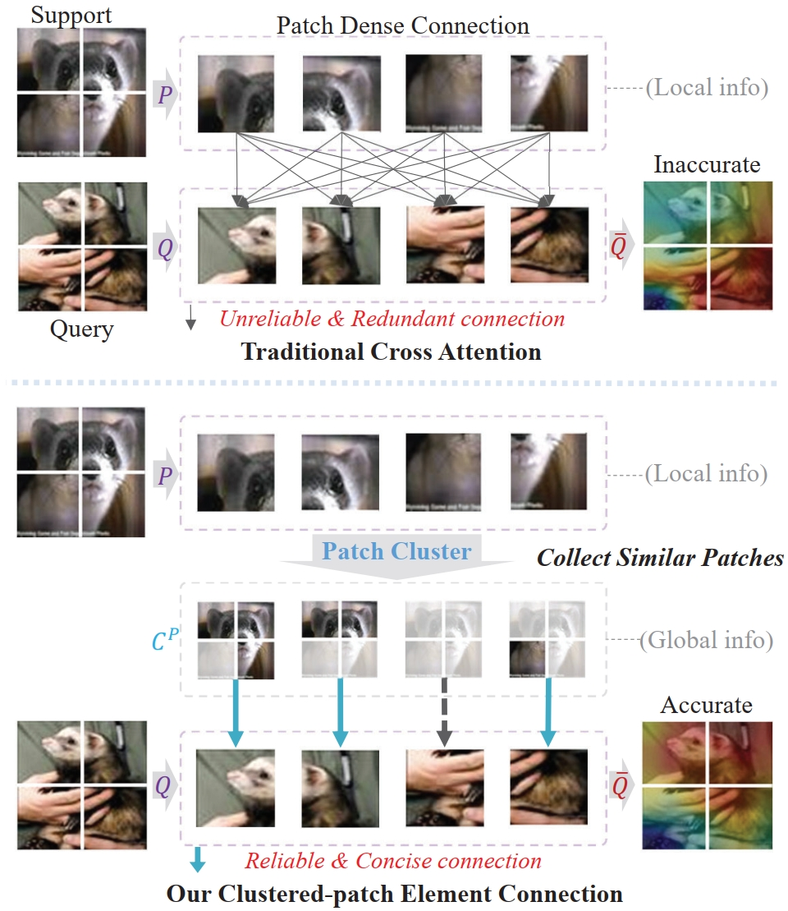
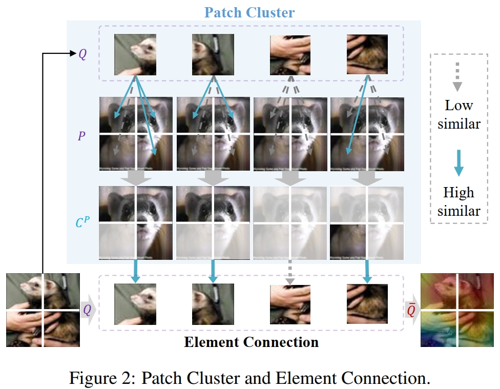
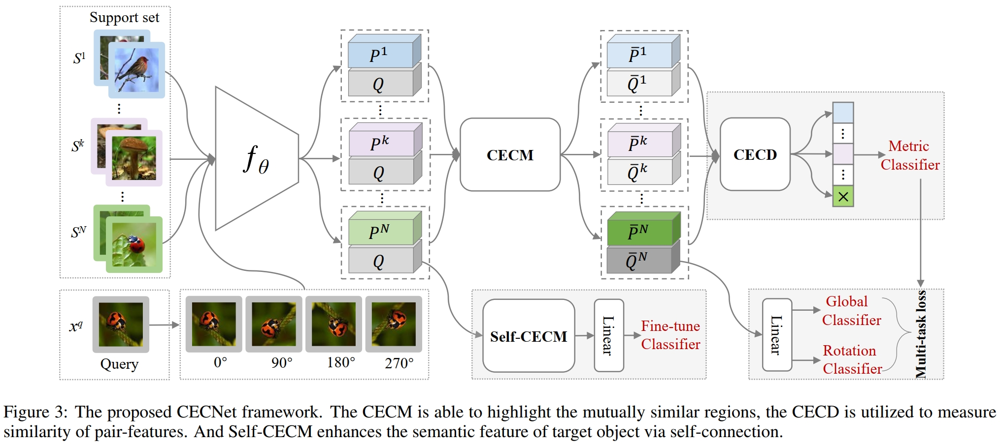
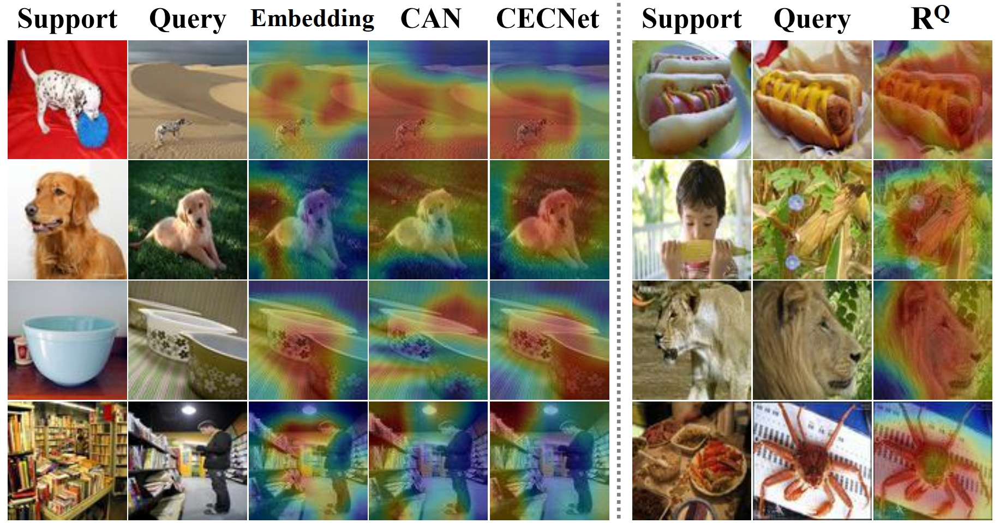

# Clustered-patch Element Connection for Few-shot Learning
This is an official implementation in PyTorch of CEC (Clustered-patch Element Connection), which is accepted by IJCAI-2023.

The full code will be released soon. 
This code is based on the implementations of [**tSF: Transformer-based Semantic Filter for Few-Shot Learning**](https://github.com/Layjins/FewShotLearning-tSF).

<p align="center">
  </a>
</p>

<p align="center">
  </a>
</p>


## Abstract

Weak feature representation problem has influenced the performance of few-shot classification task for a long time. To alleviate this problem, recent researchers build connections between support and query instances through embedding patch features to generate discriminative representations. However, we observe that there exists semantic mismatches (foreground/ background) among these local patches, because the location and size of the target object are not fixed. What is worse, these mismatches result in unreliable similarity confidences, and complex dense connection exacerbates the problem. According to this, we propose a novel Clustered-patch Element Connection (CEC) layer to correct the mismatch problem. The CEC layer leverages Patch Cluster and Element Connection operations to collect and establish reliable connections with high similarity patch features, respectively. Moreover, we propose a CECNet, including CEC layer based attention module and distance metric. The former is utilized to generate a more discriminative representation benefiting from the global clustered-patch features, and the latter is introduced to reliably measure the similarity between pair-features. Extensive experiments demonstrate that our CECNet outperforms the state-of-the-art methods on classification benchmark. Furthermore, our CEC approach can be extended into few-shot segmentation and detection tasks, which achieves competitive performances.

<p align="center">
  </a>
</p>

<p align="center">
  </a>
</p>


## Citation

If you use this code for your research, please cite our paper:
```
@article{lai2023clustered,
  title={Clustered-patch Element Connection for Few-shot Learning},
  author={Lai, Jinxiang and Yang, Siqian and Zhou, Junhong and Wu, Wenlong and Chen, Xiaochen and Liu, Jun and Gao, Bin-Bin and Wang, Chengjie},
  journal={IJCAI},
  year={2023}
}
```

## Acknowledgments

This code is based on the implementations of [**tSF: Transformer-based Semantic Filter for Few-Shot Learning**](https://github.com/Layjins/FewShotLearning-tSF).
